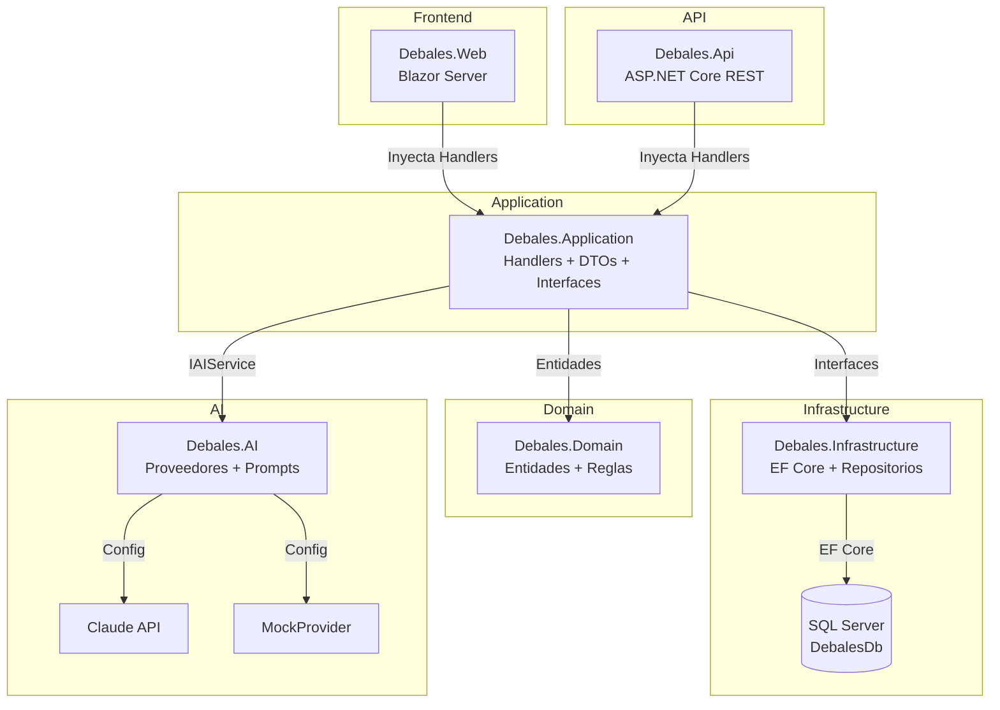
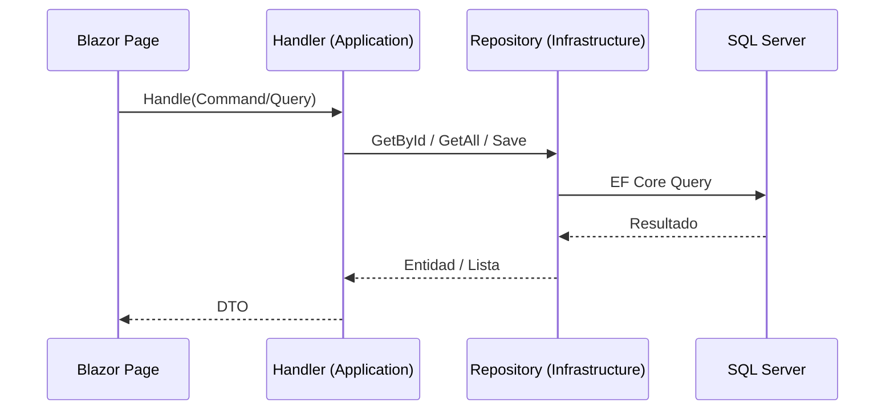
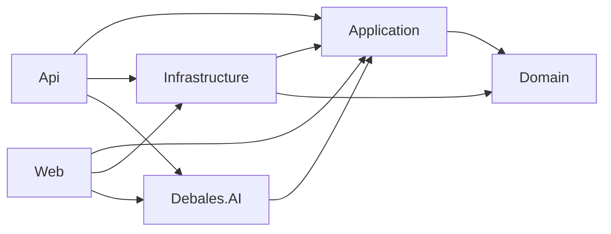

# Arquitectura de Debales

## Proyectos en la solución

| Proyecto | Tipo | Descripción |
|----------|------|-------------|
| Debales.Domain | Class Library | Entidades, Value Objects, reglas de dominio |
| Debales.Application | Class Library | Handlers, DTOs, interfaces, servicios de aplicación |
| Debales.Infrastructure | Class Library | EF Core, repositorios, migraciones, seeds, seguridad |
| Debales.AI | Class Library | Proveedores IA, prompts, orquestación |
| Debales.Api | Web API | ASP.NET Core — API REST con JWT |
| Debales.Web | Blazor Server | UI Blazor Server con paleta teal `#6B9CA9` |
| Debales.Domain.Tests | xUnit | Tests de dominio |
| Debales.Application.Tests | xUnit | Tests de handlers y contratos de repositorio |
| Debales.Integration.Tests | xUnit | Smoke tests de solución |

## Capas y responsabilidades

### Domain (`Debales.Domain`)

**Responsabilidad real (confirmada en código):**
- Entidades con lógica de negocio (`sealed class : AuditableEntity`)
- Value Objects (`Address`, `SupplierAddress`, `Email`)
- Enums de estado (`SalesOrderStatus`, `EntryStatus`, `LicenseStatus`, etc.)
- Reglas de negocio puras en métodos de entidad (`Confirm`, `Post`, `Cancel`, `Activate`)
- Invariante: ninguna entidad depende de infraestructura

### Application (`Debales.Application`)

**Responsabilidad real (confirmada en código):**
- Handlers de commands y queries (patron CQRS sin mediator, inyección directa)
- DTOs (records en su mayoría)
- Interfaces de repositorio (`ICustomerRepository`, `ISalesOrderRepository`, etc.)
- Interfaces de servicios (`IAccountingEntryService`, `ILicenseService`, `IAIService`)
- `DependencyInjection.cs` registra ~80 handlers

### Infrastructure (`Debales.Infrastructure`)

**Responsabilidad real (confirmada en código):**
- `ApplicationDbContext` con 40+ DbSets
- Repositorios concretos por módulo
- Configuraciones EF (`IEntityTypeConfiguration<T>`)
- Migraciones EF Core (10 migraciones)
- Seeds: `DbSeeder` (roles + admin), `DemoDataSeeder` (datos demo), `CatalogSeeder`, `AccountingSeeds`
- Seguridad: `JwtTokenService`, `PasswordHasher`
- `LicenseService` — servicio de dominio de licenciamiento

### AI (`Debales.AI`)

**Responsabilidad real (confirmada en código):**
- `IAIProvider` — interfaz de proveedor
- `ClaudeProvider` — integración real con Claude API
- `MockAIProvider` — proveedor para desarrollo/tests
- `AIService` — orquestador
- `PromptBuilder` — construcción de prompts
- Selección de proveedor por configuración (`AI__Provider=Mock|Claude`)

### Api (`Debales.Api`)

**Responsabilidad real (confirmada en código):**
- 20 controllers con rutas `api/[recurso]`
- JWT Bearer Authentication + Authorization
- Swagger con soporte Bearer
- Mapeo directo a Handlers (sin mediator)
- Manejo global de excepciones (404/400/401/409/500)
- Auto-migración + seed en startup

### Web (`Debales.Web`)

**Responsabilidad real (confirmada en código):**
- Blazor Server con `InteractiveServer` render mode
- 44 páginas `.razor` organizadas por módulo
- Paleta teal `#6B9CA9` en sidebar y elementos de UI
- Inyecta Handlers directamente (mismo proceso que API)
- Autenticación por cookie JWT (inferido — no confirmado el mecanismo exacto)

---

## Diagrama de arquitectura

## Flujo típico: UI → SQL Server

## Dependencias entre proyectos

## Inconsistencias detectadas

1. **Sin mediator**: El proyecto usa CQRS sin librería mediator. Los handlers se inyectan directamente como servicios `Scoped`. Esto es válido pero diferente a lo habitual con MediatR.
2. **Web accede a Infrastructure directamente**: `Debales.Web` referencia `Debales.Infrastructure` además de `Debales.Application`, lo que significa que Blazor puede acceder al DbContext. Esto viola la separación estricta de capas, aunque en la práctica el código Blazor solo inyecta Handlers.
3. **CLAUDE.md §46 vs código**: Licensing y Docker están implementados; CLAUDE.md los marca como pendientes.
