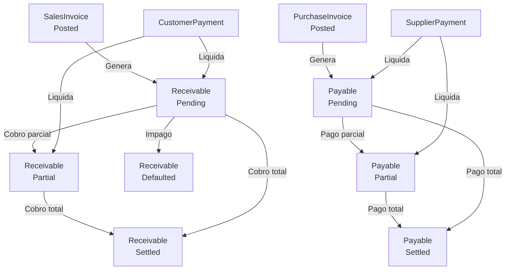

# Flujo: Cobro y Pago

## Diagrama

## Estados de Receivable (Vencimiento de cobro)

| Estado | Descripción |
|--------|-------------|
| `Pending` | Pendiente de cobro |
| `Partial` | Cobrado parcialmente |
| `Settled` | Cobrado completamente |
| `Defaulted` | Impagado declarado |
| `Cancelled` | Cancelado |

## Estados de Payable (Vencimiento de pago)

Mismo modelo que Receivable: `Pending | Partial | Settled | Defaulted | Cancelled`

## Flujo de cobro

### 1. Vencimiento generado

Al contabilizar una `SalesInvoice` (`PostSalesInvoiceHandler`), se genera automáticamente un `Receivable` con:
- Importe: Total de la factura
- Fecha vencimiento: `DueDate` de la factura
- Estado: `Pending`

### 2. Registrar cobro

- Handler: `CreateCustomerPaymentHandler`
- Entidad: `CustomerPayment`
- Liquida uno o varios `Receivable`
- Puede ser pago parcial o total

## Flujo de pago

### 1. Vencimiento generado

Al contabilizar una `PurchaseInvoice`, se genera un `Payable`.

### 2. Registrar pago

- Handler: `CreateSupplierPaymentHandler`
- Entidad: `SupplierPayment`
- Liquida uno o varios `Payable`

## Integración contable (pendiente)

La generación de asientos desde cobros/pagos no está confirmada en el código actual. El `AccountingEntryService` tiene plantillas para facturas pero no se confirmó la existencia de plantillas para cobros/pagos.
