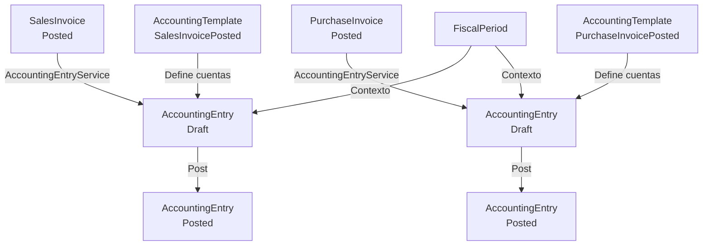

# Flujo: Factura a Contabilidad

## Descripción

Generación automática de asientos contables desde eventos de facturación. Usa plantillas de asiento para determinar las cuentas y los importes.

## Diagrama



## Plantillas de asiento sembradas

### SalesInvoicePosted (Factura de venta contabilizada)

| Posición | Cuenta | Debe | Haber |
|----------|--------|------|-------|
| 1 | 430 Clientes | Importe total factura | — |
| 2 | 700 Ventas | — | Base imponible |
| 3 | 477 IVA Repercutido | — | Cuota IVA |

### PurchaseInvoicePosted (Factura de compra contabilizada)

| Posición | Cuenta | Debe | Haber |
|----------|--------|------|-------|
| 1 | 600 Compras | Base imponible | — |
| 2 | 472 HP IVA Soportado | Cuota IVA | — |
| 3 | 400 Proveedores | — | Importe total |

## Invariante de cuadre

```
TotalDebit == TotalCredit
```

Validado en `AccountingEntry.Post()`. Si no cuadra, lanza `InvalidOperationException`.

## Estados contables

### Asiento

`Draft → Posted | Cancelled`

- `Posted` = definitivo, no modificable
- `Cancelled` = anulado con trazabilidad
- Para anular un `Posted` → crear asiento de reversión manual

### Período fiscal

`Open → Closed → Locked`

- No se puede contabilizar en período `Closed` o `Locked`
- Cierre de período: `CloseFiscalPeriodHandler`
- Cierre de ejercicio: `CloseFiscalYearHandler`

## Flujo pendiente de implementar

- Generación de asiento desde `CustomerPayment` (cobro de cliente) — no confirmado en código actual
- Generación de asiento desde `SupplierPayment` (pago a proveedor) — no confirmado
