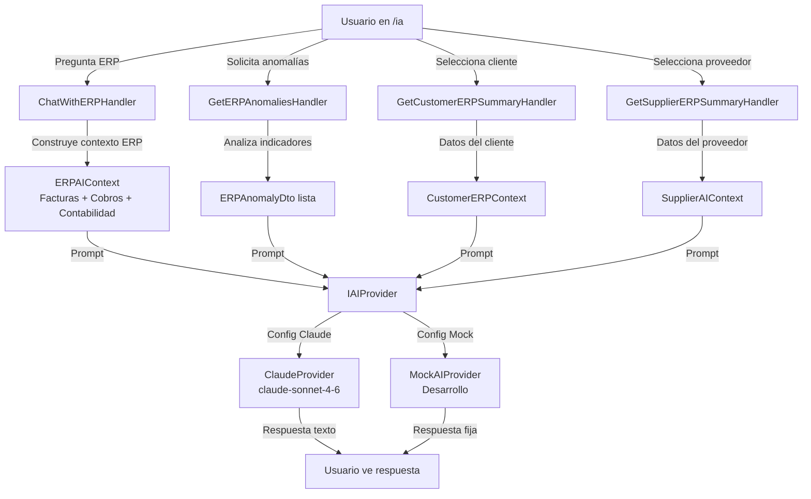

# Flujo: IA Supervisada

## Diagrama



## Principio de supervisión

La IA **no puede modificar datos**. Solo puede:
- Leer contexto construido explícitamente por los handlers
- Generar texto de análisis y recomendaciones
- Detectar patrones en los datos

## Flujo de Chat ERP

1. Usuario escribe pregunta en `/ia` tab "Chat ERP"
2. `ChatWithERPHandler` recopila datos ERP actuales (facturas, cobros, pagos, asientos)
3. Construye `ERPAIContext` con los datos relevantes
4. `PromptBuilder` genera el prompt con contexto
5. `IAIProvider` (Claude o Mock) genera la respuesta
6. Respuesta aparece en el chat como burbuja del asistente

## Flujo de Anomalías

1. Usuario activa tab "Anomalías" o pulsa "Actualizar"
2. `GetERPAnomaliesHandler` analiza indicadores del ERP:
   - Facturas sin contabilizar
   - Vencimientos vencidos
   - Stock bajo mínimos (inferido)
   - Asientos descuadrados (si draft)
3. Devuelve lista de `ERPAnomalyDto` con severidad (Alta/Media/Ok)
4. UI muestra alertas con color según severidad

## Flujo de Análisis cliente/proveedor

1. Usuario selecciona cliente o proveedor en dropdown
2. Handler recopila datos ERP del tercero (facturas, cobros/pagos, pendientes)
3. IA genera resumen financiero en texto libre
4. Texto aparece en card de análisis

## Configuración

```
AI__Provider=Claude    → usa ClaudeProvider (requiere AI__ApiKey)
AI__Provider=Mock      → usa MockAIProvider (sin API key)
AI__Model=claude-sonnet-4-6   → modelo por defecto
```
