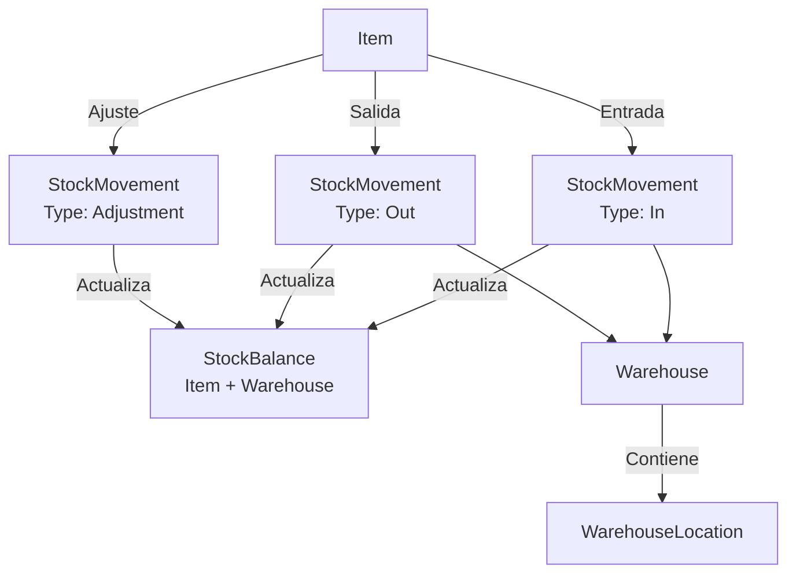

# Flujo: Inventario

## Diagrama

## Tipos de movimiento (StockMovementType)

| Tipo | Descripción |
|------|-------------|
| `In` | Entrada de mercancía |
| `Out` | Salida de mercancía |
| `Transfer` | Traslado entre almacenes |
| `Adjustment` | Ajuste de inventario |

## Flujo de movimiento

### 1. Crear almacén

- Handler: `CreateWarehouseHandler`
- Código + Nombre (Code uppercase, único)

### 2. Añadir ubicación

- Handler: `AddWarehouseLocationHandler`
- Vinculada a un almacén específico

### 3. Registrar movimiento

- Handler: `CreateStockMovementHandler`
- Automáticamente actualiza `StockBalance`
- `StockBalance` es la tabla de saldo actual: Item × Warehouse

### 4. Consultar saldo

- Handler: `GetStockBalanceHandler`
- Filtra por artículo y/o almacén

## Relación con otros módulos

- Los albaranes de venta/compra deberían generar movimientos de stock automáticamente (integración **no confirmada** en el código actual)
- Los movimientos de tipo `In` se usan en `DemoDataSeeder` para cargar stock inicial

## Datos demo

| Artículo | Almacén | Stock inicial |
|----------|---------|---------------|
| TUB-001 | ALM-01 | 500 UN |
| VAL-001 | ALM-01 | 150 UN |
| CEM-001 | ALM-01 | 2000 KG |
