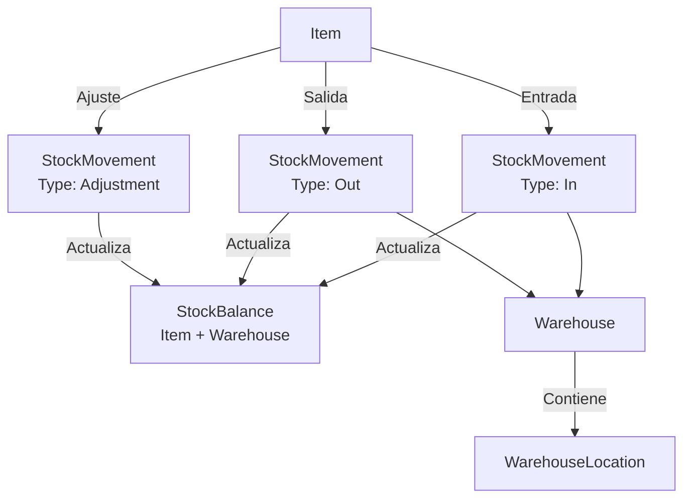

# Flujo: Inventario

## Diagrama



## Tipos de movimiento (StockMovementType)

| Tipo | Descripción |
|------|-------------|
| `In` | Entrada de mercancía |
| `Out` | Salida de mercancía |
| `Transfer` | Traslado entre almacenes |
| `Adjustment` | Ajuste de inventario |

## Flujo de movimiento

### 1. Crear almacén

- Handler: `CreateWarehouseHandler`
- Código + Nombre (Code uppercase, único)

### 2. Añadir ubicación

- Handler: `AddWarehouseLocationHandler`
- Vinculada a un almacén específico

### 3. Registrar movimiento

- Handler: `CreateStockMovementHandler`
- Automáticamente actualiza `StockBalance`
- `StockBalance` es la tabla de saldo actual: Item × Warehouse

### 4. Consultar saldo

- Handler: `GetStockBalanceHandler`
- Filtra por artículo y/o almacén

## Relación con otros módulos — Integración automática (implementada 2026-06-05)

Los albaranes de venta y compra generan movimientos de stock automáticamente al confirmarse (Post).

### Albarán de venta → StockMovement.Out

Handler: `PostSalesDeliveryNoteHandler`

```
SalesDeliveryNote.Post(updatedBy)
  → por cada línea con cantidad > 0
      StockMovement.Create(number, Type.Out, itemId, ...)
      qty = -Math.Abs(line.Quantity)   ← negativo = salida
      StockBalance actualizado (upsert)
```

Almacén: se toma del parámetro opcional `WarehouseId` del comando. Si no se especifica, se usa el primer almacén activo disponible. Si no hay ninguno, los movimientos se omiten silenciosamente.

### Albarán de compra → StockMovement.In

Handler: `PostPurchaseDeliveryNoteHandler`

```
PurchaseDeliveryNote.Post(updatedBy)
  → por cada línea con cantidad > 0
      StockMovement.Create(number, Type.In, itemId, ...)
      qty = +Math.Abs(line.Quantity)   ← positivo = entrada
      StockBalance actualizado (upsert)
```

### Selector de almacén en UI

`AlbaranVentaDetalle.razor` y `AlbaranCompraDetalle.razor` muestran un modal selector de almacén antes de confirmar. Si solo hay un almacén, se preselecciona automáticamente.

- Los movimientos de tipo `In` se usan también en `DemoDataSeeder` para cargar stock inicial

## Datos demo

| Artículo | Almacén | Stock inicial |
|----------|---------|---------------|
| TUB-001 | ALM-01 | 500 UN |
| VAL-001 | ALM-01 | 150 UN |
| CEM-001 | ALM-01 | 2000 KG |
