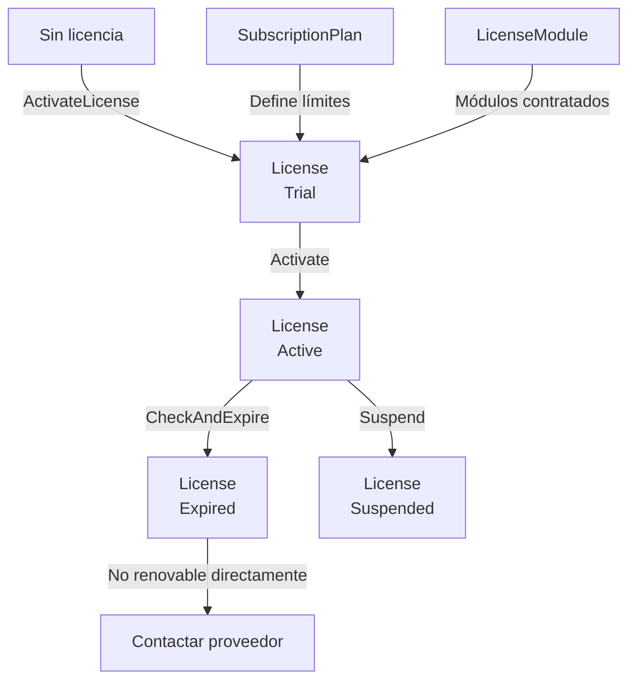

# Flujo: Licenciamiento

## Diagrama

## Pasos

### 1. Ver planes disponibles

- Handler: `GetSubscriptionPlansHandler`
- UI: `/licencia` muestra planes con límites (usuarios, módulos, IA incluida, precio)

### 2. Activar licencia

- Handler: `ActivateLicenseHandler`
- Command: `ActivateLicenseCommand` con clave, empresa, email, plan, fechas, módulos
- La clave se almacena en uppercase
- La instalación se identifica por `Environment.MachineName` desde UI

### 3. Estado Trial → Active

- `License.Create()` crea con `Status = Trial`
- `License.Activate()` pasa a `Active`

### 4. Verificar módulo

- `License.HasModule(moduleCode)` — comprueba si la licencia es válida y tiene el módulo
- `License.IsValid()` — valida estado + fechas

### 5. Verificar expiración

- `License.CheckAndExpire()` — marca `Expired` si `DateTime.UtcNow > ExpiresAt`

## UI de licencia (`/licencia`)

**Sin licencia activa:**
- Alerta de advertencia
- Lista de planes disponibles con precios
- Formulario de activación (clave, empresa, email, plan, fechas)

**Con licencia activa:**
- Tarjetas de estado: estado, plan, empresa, días restantes
- Módulos contratados como badges
- Aviso si quedan < 15 días

## Lo que falta

- Validación de licencia en middleware para bloqueo gradual
- Renovación desde UI sin re-activar
- Modo offline con cache local
