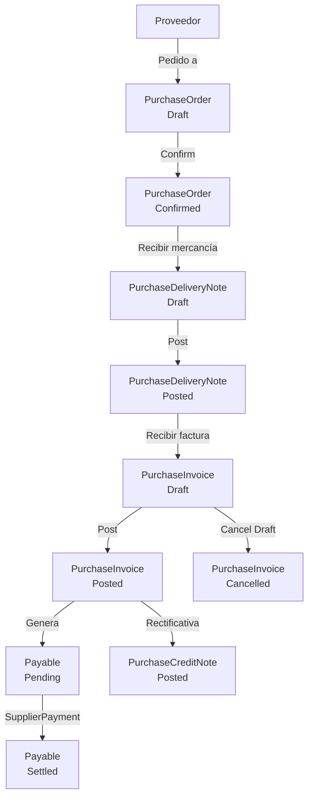

# Flujo: Pedido de Compra a Factura

## Diagrama

## Pasos detallados

### 1. Crear pedido de compra

- Handler: `CreatePurchaseOrderHandler`
- Entidad: `PurchaseOrder` (Status: Draft)

### 2. Confirmar pedido

- Handler: `ConfirmPurchaseOrderHandler`
- Status: Draft → Confirmed

### 3. Crear albarán de compra (recepción de mercancía)

- Handler: `CreatePurchaseDeliveryNoteHandler`
- Entidad: `PurchaseDeliveryNote` (vinculada a pedido)

### 4. Emitir albarán

- Handler: `PostPurchaseDeliveryNoteHandler`
- Status: Draft → Posted
- **Genera movimiento de stock automático** `StockMovement.In` por cada línea (implementado 2026-06-05)
- UI: selector de almacén modal en `AlbaranCompraDetalle.razor`

### 5. Generar factura desde albarán (flujo espejo — implementado 2026-06-05)

- Handler: `GenerateInvoiceFromPurchaseDeliveryNoteHandler`
- Crea `PurchaseInvoice` automáticamente desde el albarán Posted
- Precios: toma de líneas de `PurchaseOrder` vía `PurchaseOrderLineId`; fallback a `item.PurchasePrice`
- UI: botón "Generar factura" en `AlbaranCompraDetalle.razor` (visible cuando albarán Posted y sin factura)

### 6. (Alternativo) Registrar factura manual del proveedor

- Handler: `CreatePurchaseInvoiceHandler`
- `SupplierInvoiceNumber` — número de factura del proveedor (campo específico)
- `DueDate >= Date` validado

### 6. Contabilizar factura de compra

- Handler: `PostPurchaseInvoiceHandler`
- Status: Draft → Posted
- Genera `Payable` (vencimiento de pago)

### 7. Registrar pago a proveedor

- Handler: `CreateSupplierPaymentHandler`
- Entidad: `SupplierPayment`
- Liquida el `Payable` (Pending → Settled)

## Diferencias con el flujo de ventas

| Aspecto | Ventas | Compras |
|---------|--------|---------|
| Número factura proveedor | N/A | `SupplierInvoiceNumber` adicional |
| Generación automática batch | Sí (`BatchGenerateDocuments`) | No implementado |
| Generar factura desde albarán | Sí (batch + individual) | Sí (individual, desde AlbaranCompraDetalle) |
| Actualización estado pedido al confirmar albarán | Sí → `Delivered` | **No** — pendiente (Prioridad 5) |
| Stock movimiento al confirmar albarán | Out (salida) | In (entrada) |
| Vencimiento generado | `Receivable` | `Payable` |
| Cobro/Pago | `CustomerPayment` | `SupplierPayment` |
| PDF factura | Sí — `/descargar/factura-venta/{id}` | Sí — `/descargar/factura-compra/{id}` |
