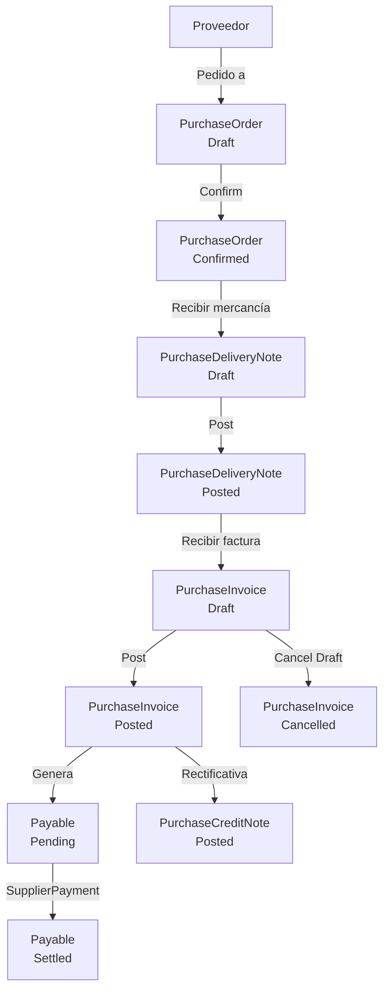

# Flujo: Pedido de Compra a Factura

## Diagrama

## Pasos detallados

### 1. Crear pedido de compra

- Handler: `CreatePurchaseOrderHandler`
- Entidad: `PurchaseOrder` (Status: Draft)

### 2. Confirmar pedido

- Handler: `ConfirmPurchaseOrderHandler`
- Status: Draft → Confirmed

### 3. Crear albarán de compra (recepción de mercancía)

- Handler: `CreatePurchaseDeliveryNoteHandler`
- Entidad: `PurchaseDeliveryNote` (vinculada a pedido)

### 4. Emitir albarán

- Handler: `PostPurchaseDeliveryNoteHandler`
- Status: Draft → Posted
- Nota: puede actualizar stock (integración no confirmada)

### 5. Registrar factura del proveedor

- Handler: `CreatePurchaseInvoiceHandler`
- `SupplierInvoiceNumber` — número de factura del proveedor (campo específico)
- `DueDate >= Date` validado

### 6. Contabilizar factura de compra

- Handler: `PostPurchaseInvoiceHandler`
- Status: Draft → Posted
- Genera `Payable` (vencimiento de pago)

### 7. Registrar pago a proveedor

- Handler: `CreateSupplierPaymentHandler`
- Entidad: `SupplierPayment`
- Liquida el `Payable` (Pending → Settled)

## Diferencias con el flujo de ventas

| Aspecto | Ventas | Compras |
|---------|--------|---------|
| Número factura proveedor | N/A | `SupplierInvoiceNumber` adicional |
| Generación automática batch | Sí (`BatchGenerateDocuments`) | No (manual) |
| Vencimiento generado | `Receivable` | `Payable` |
| Cobro/Pago | `CustomerPayment` | `SupplierPayment` |
