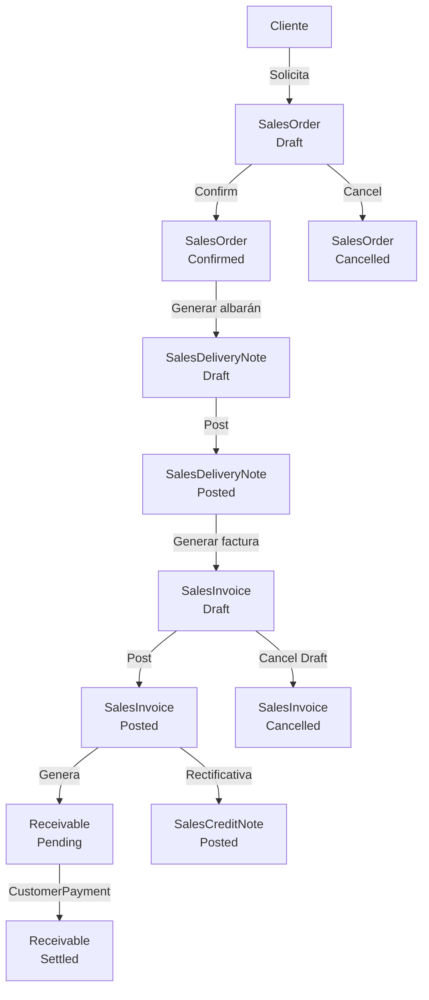

# Flujo: Pedido de Venta a Factura

## Descripción

Ciclo completo de ventas desde la creación del pedido por el cliente hasta la emisión de la factura. Incluye la generación automática en lote.

## Diagrama

## Pasos detallados

### 1. Crear pedido de venta

- Handler: `CreateSalesOrderHandler`
- Entidad: `SalesOrder` (Status: Draft)
- Requiere: cliente, fecha, al menos una línea con artículo
- UI: Formulario en `/ventas/pedidos` con modal

### 2. Confirmar pedido

- Handler: `ConfirmSalesOrderHandler`
- Status: Draft → Confirmed
- Validación: debe tener líneas

### 3. Generar albarán desde pedido

- **Opción A (manual)**: `CreateSalesDeliveryNoteHandler` → añadir líneas manualmente
- **Opción B (automático)**: `GenerateDeliveryNoteFromOrderHandler` → copia todas las líneas del pedido
- **Opción C (lote)**: `BatchGenerateDocumentsHandler` → pedido → albarán → factura de una vez
- Entidad: `SalesDeliveryNote` (Status: Draft)
- UI: `/ventas/automatizacion` para el lote

### 4. Emitir albarán

- Handler: `PostSalesDeliveryNoteHandler`
- Status: Draft → Posted
- Actualiza `DeliveredQuantity` en líneas del pedido → recalcula status del pedido

### 5. Generar factura desde albarán

- **Opción A (manual)**: `CreateSalesInvoiceHandler`
- **Opción B (automático)**: `GenerateInvoiceFromDeliveryNoteHandler`
- Entidad: `SalesInvoice` (Status: Draft, FK a SalesDeliveryNote)

### 6. Contabilizar factura

- Handler: `PostSalesInvoiceHandler`
- Status: Draft → Posted
- Genera `Receivable` (vencimiento de cobro)

### 7. Registrar cobro

- Handler: `CreateCustomerPaymentHandler`
- Entidad: `CustomerPayment`
- Liquida el `Receivable` (Pending → Settled)

## Cancelaciones y rectificativas

| Situación | Acción |
|-----------|--------|
| Factura Draft sin contabilizar | `CancelSalesInvoiceHandler` |
| Factura Posted | Emitir `SalesCreditNote` con `PostSalesCreditNoteHandler` |
| Pedido antes de entregar | `CancelSalesOrderHandler` |

## Datos demo (DemoDataSeeder)

- **Escenario A**: Pedido PV-2026-0001 (Herrera) — Confirmed, sin albarán
- **Escenario B**: Pedido PV-2026-0002 (Norte) — Albarán ALV-2026-0001 emitido, pendiente factura
- **Escenario C**: Flujo completo PV-2026-0003 → ALV-2026-0002 → FV-2026-0001 (Posted)
