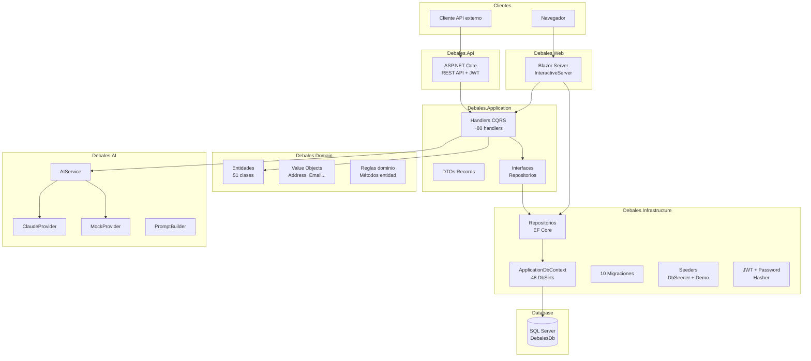

# Diagrama: Arquitectura general

## Notas sobre el diagrama

- Blazor accede directamente a repositorios además de handlers (dependencia real en código)
- Los handlers son Scoped, no singleton
- La selección Claude/Mock se hace en arranque por configuración
