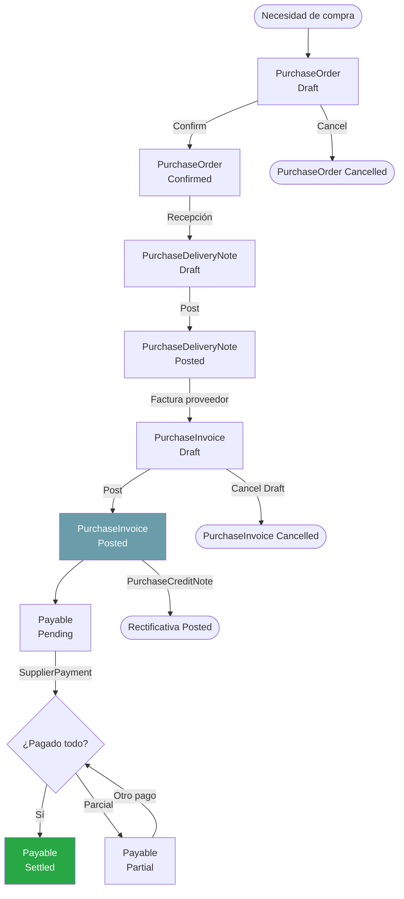

# Diagrama: Flujo de Compras

## Diferencia clave con Ventas

`PurchaseInvoice` tiene el campo adicional `SupplierInvoiceNumber` para registrar el número de factura del proveedor. No existe generación automática en lote como en ventas (`BatchGenerateDocuments`).
