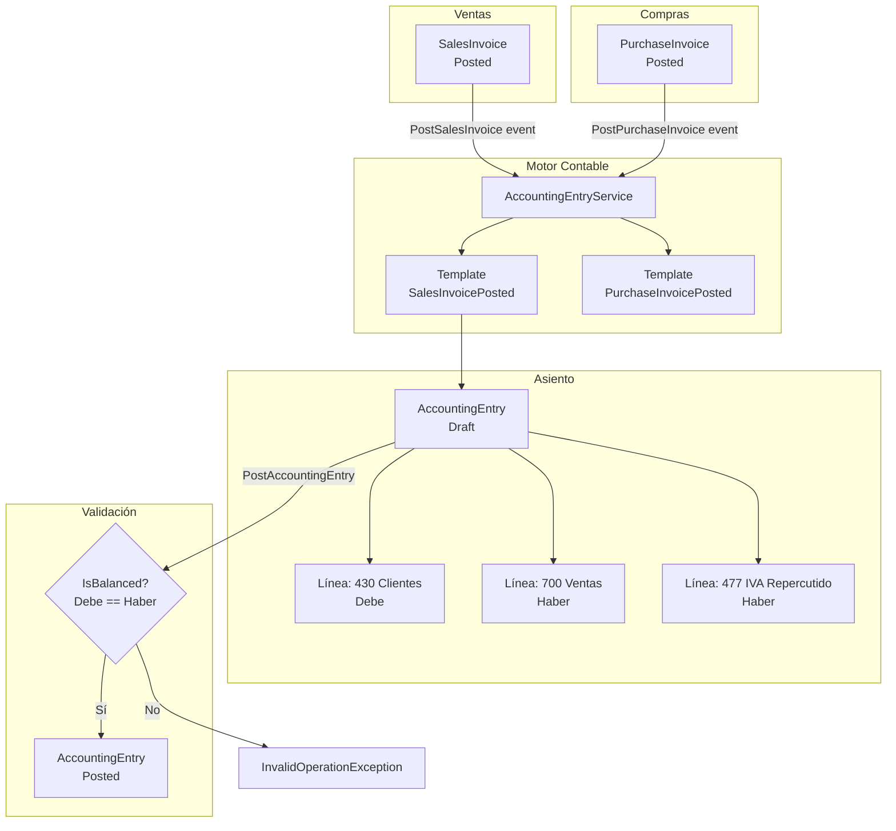

# Diagrama: Factura a Contabilidad

## Invariante de cuadre

| Cuenta | Ventas | Compras |
|--------|--------|---------|
| 430 Clientes | Debe (total) | — |
| 400 Proveedores | — | Haber (total) |
| 700 Ventas | Haber (base) | — |
| 477 IVA Rep. | Haber (IVA) | — |
| 600 Compras | — | Debe (base) |
| 472 IVA Sop. | — | Debe (IVA) |
