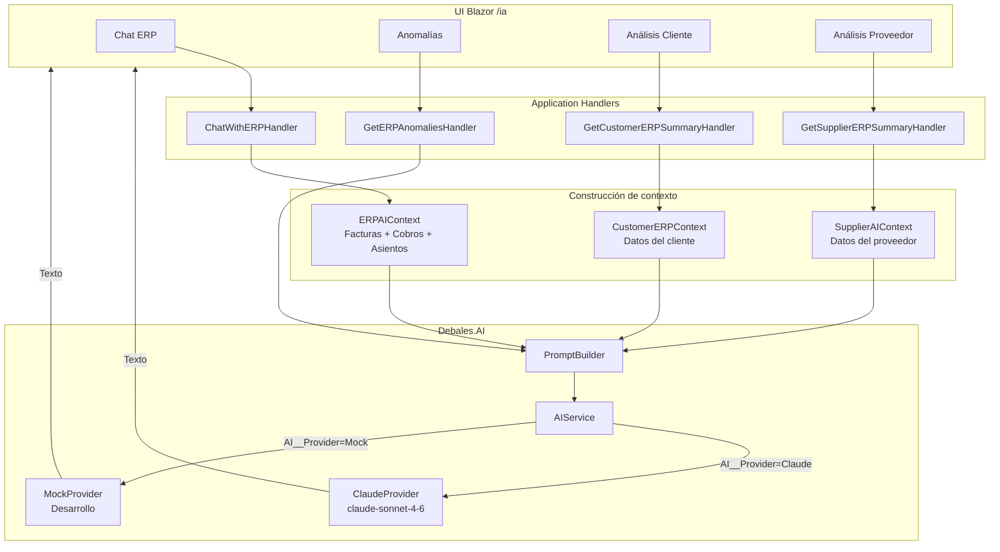

# Diagrama: Flujo IA Supervisada


```mermaid
flowchart TD
    subgraph UI[UI Blazor /ia]
        Tab1[Chat ERP]
        Tab2[Anomalías]
        Tab3[Análisis Cliente]
        Tab4[Análisis Proveedor]
    end

    subgraph Handlers[Application Handlers]
        H1[ChatWithERPHandler]
        H2[GetERPAnomaliesHandler]
        H3[GetCustomerERPSummaryHandler]
        H4[GetSupplierERPSummaryHandler]
    end

    subgraph Contexto[Construcción de contexto]
        CTX1[ERPAIContext\nFacturas + Cobros + Asientos]
        CTX2[CustomerERPContext\nDatos del cliente]
        CTX3[SupplierAIContext\nDatos del proveedor]
    end

    subgraph AI[Debales.AI]
        PB[PromptBuilder]
        SVC[AIService]
        CLAUDE[ClaudeProvider\nclaude-sonnet-4-6]
        MOCK[MockProvider\nDesarrollo]
    end

    Tab1 --> H1
    Tab2 --> H2
    Tab3 --> H3
    Tab4 --> H4

    H1 --> CTX1 --> PB
    H2 --> PB
    H3 --> CTX2 --> PB
    H4 --> CTX3 --> PB

    PB --> SVC
    SVC -->|AI__Provider=Claude| CLAUDE
    SVC -->|AI__Provider=Mock| MOCK

    CLAUDE -->|Texto| UI
    MOCK -->|Texto| UI
```

## Principio de supervisión

```
La IA solo LEE datos.
La IA NO puede ESCRIBIR en la base de datos.
Toda acción sobre datos requiere aprobación humana.
```
