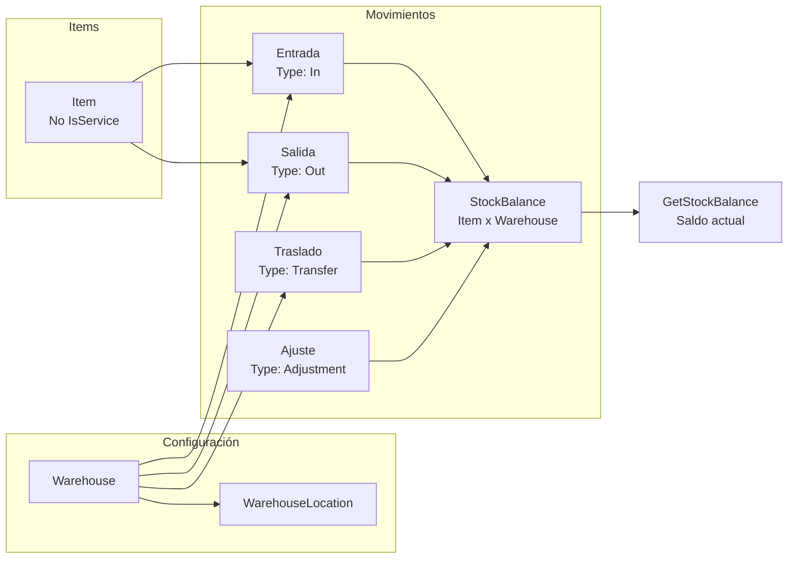
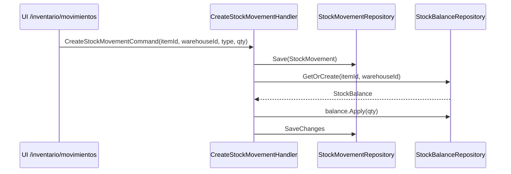

# Diagrama: Flujo de Inventario

```mermaid
flowchart LR
    subgraph Configuración
        W[Warehouse] --> WL[WarehouseLocation]
    end

    subgraph Movimientos
        IN[Entrada\nType: In] --> SB[StockBalance\nItem x Warehouse]
        OUT[Salida\nType: Out] --> SB
        TRF[Traslado\nType: Transfer] --> SB
        ADJ[Ajuste\nType: Adjustment] --> SB
    end

    subgraph Items
        Item[Item\nNo IsService]
    end

    Item --> IN
    Item --> OUT
    W --> IN
    W --> OUT
    W --> TRF

    SB --> QUERY[GetStockBalance\nSaldo actual]
```

## Flujo de movimiento simple

```mermaid
sequenceDiagram
    participant UI as UI /inventario/movimientos
    participant H as CreateStockMovementHandler
    participant R as StockMovementRepository
    participant BR as StockBalanceRepository

    UI->>H: CreateStockMovementCommand(itemId, warehouseId, type, qty)
    H->>R: Save(StockMovement)
    H->>BR: GetOrCreate(itemId, warehouseId)
    BR-->>H: StockBalance
    H->>BR: balance.Apply(qty)
    H->>R: SaveChanges
```
