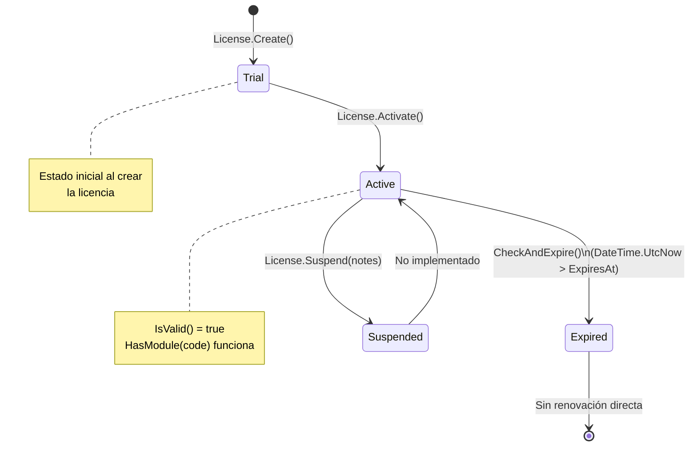
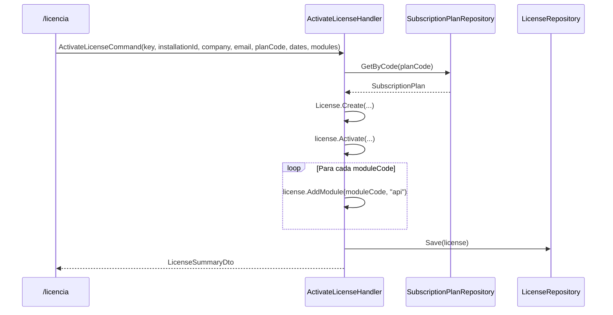

# Diagrama: Licenciamiento

```mermaid
stateDiagram-v2
    [*] --> Trial: License.Create()
    Trial --> Active: License.Activate()
    Active --> Expired: CheckAndExpire()\n(DateTime.UtcNow > ExpiresAt)
    Active --> Suspended: License.Suspend(notes)
    Expired --> [*]: Sin renovación directa
    Suspended --> Active: No implementado

    note right of Trial
        Estado inicial al crear
        la licencia
    end note
    
    note right of Active
        IsValid() = true
        HasModule(code) funciona
    end note
```

## Ciclo de activación desde UI

```mermaid
sequenceDiagram
    participant UI as /licencia
    participant H as ActivateLicenseHandler
    participant SPR as SubscriptionPlanRepository
    participant LR as LicenseRepository

    UI->>H: ActivateLicenseCommand(key, installationId, company, email, planCode, dates, modules)
    H->>SPR: GetByCode(planCode)
    SPR-->>H: SubscriptionPlan
    H->>H: License.Create(...)
    H->>H: license.Activate(...)
    loop Para cada moduleCode
        H->>H: license.AddModule(moduleCode, "api")
    end
    H->>LR: Save(license)
    H-->>UI: LicenseSummaryDto
```
