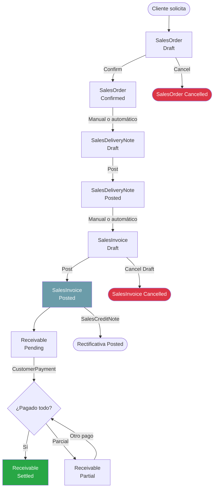
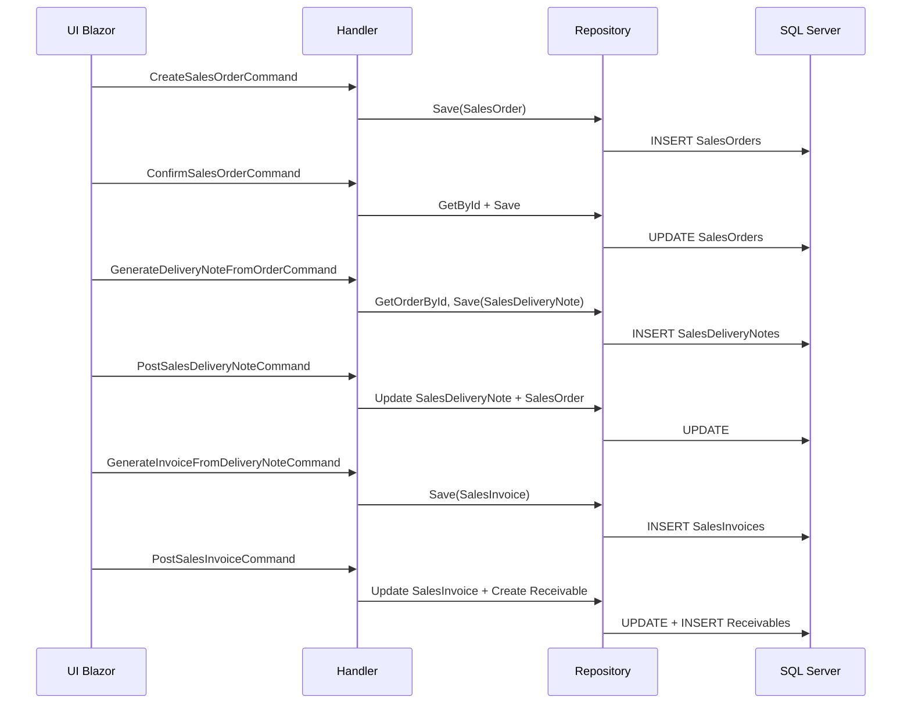

# Diagrama: Flujo de Ventas

```mermaid
flowchart TD
    A([Cliente solicita]) --> B[SalesOrder\nDraft]
    B -->|Confirm| C[SalesOrder\nConfirmed]
    C -->|Manual o automático| D[SalesDeliveryNote\nDraft]
    D -->|Post| E[SalesDeliveryNote\nPosted]
    E -->|Manual o automático| F[SalesInvoice\nDraft]
    F -->|Post| G[SalesInvoice\nPosted]
    G --> H[Receivable\nPending]
    H -->|CustomerPayment| I{¿Pagado todo?}
    I -->|Sí| J[Receivable\nSettled]
    I -->|Parcial| K[Receivable\nPartial]
    K -->|Otro pago| I

    B -->|Cancel| L([SalesOrder Cancelled])
    F -->|Cancel Draft| M([SalesInvoice Cancelled])
    G -->|SalesCreditNote| N([Rectificativa Posted])

    style G fill:#6B9CA9,color:#fff
    style J fill:#28a745,color:#fff
    style L fill:#dc3545,color:#fff
    style M fill:#dc3545,color:#fff
```

## Handlers del flujo

```mermaid
sequenceDiagram
    participant UI as UI Blazor
    participant H as Handler
    participant R as Repository
    participant DB as SQL Server

    UI->>H: CreateSalesOrderCommand
    H->>R: Save(SalesOrder)
    R->>DB: INSERT SalesOrders

    UI->>H: ConfirmSalesOrderCommand
    H->>R: GetById + Save
    R->>DB: UPDATE SalesOrders

    UI->>H: GenerateDeliveryNoteFromOrderCommand
    H->>R: GetOrderById, Save(SalesDeliveryNote)
    R->>DB: INSERT SalesDeliveryNotes

    UI->>H: PostSalesDeliveryNoteCommand
    H->>R: Update SalesDeliveryNote + SalesOrder
    R->>DB: UPDATE

    UI->>H: GenerateInvoiceFromDeliveryNoteCommand
    H->>R: Save(SalesInvoice)
    R->>DB: INSERT SalesInvoices

    UI->>H: PostSalesInvoiceCommand
    H->>R: Update SalesInvoice + Create Receivable
    R->>DB: UPDATE + INSERT Receivables
```
