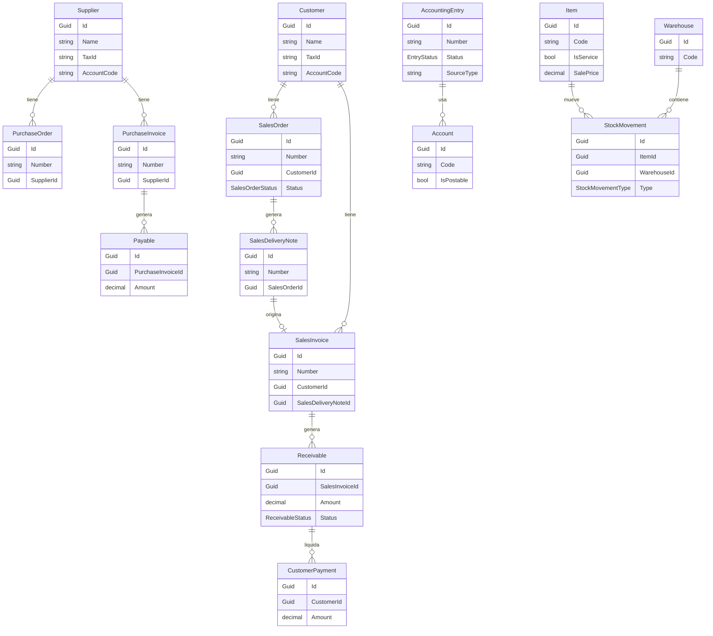

# Diagrama: Relación de entidades principales

```mermaid
erDiagram
    Customer {
        Guid Id
        string Name
        string TaxId
        string AccountCode
    }
    Supplier {
        Guid Id
        string Name
        string TaxId
        string AccountCode
    }
    Item {
        Guid Id
        string Code
        bool IsService
        decimal SalePrice
    }
    SalesOrder {
        Guid Id
        string Number
        Guid CustomerId
        SalesOrderStatus Status
    }
    SalesDeliveryNote {
        Guid Id
        string Number
        Guid SalesOrderId
    }
    SalesInvoice {
        Guid Id
        string Number
        Guid CustomerId
        Guid SalesDeliveryNoteId
    }
    Receivable {
        Guid Id
        Guid SalesInvoiceId
        decimal Amount
        ReceivableStatus Status
    }
    CustomerPayment {
        Guid Id
        Guid CustomerId
        decimal Amount
    }
    PurchaseOrder {
        Guid Id
        string Number
        Guid SupplierId
    }
    PurchaseInvoice {
        Guid Id
        string Number
        Guid SupplierId
    }
    Payable {
        Guid Id
        Guid PurchaseInvoiceId
        decimal Amount
    }
    AccountingEntry {
        Guid Id
        string Number
        EntryStatus Status
        string SourceType
    }
    Account {
        Guid Id
        string Code
        bool IsPostable
    }
    Warehouse {
        Guid Id
        string Code
    }
    StockMovement {
        Guid Id
        Guid ItemId
        Guid WarehouseId
        StockMovementType Type
    }

    Customer ||--o{ SalesOrder : "tiene"
    Customer ||--o{ SalesInvoice : "tiene"
    SalesOrder ||--o{ SalesDeliveryNote : "genera"
    SalesDeliveryNote ||--o| SalesInvoice : "origina"
    SalesInvoice ||--o{ Receivable : "genera"
    Receivable ||--o{ CustomerPayment : "liquida"

    Supplier ||--o{ PurchaseOrder : "tiene"
    Supplier ||--o{ PurchaseInvoice : "tiene"
    PurchaseInvoice ||--o{ Payable : "genera"

    Item ||--o{ StockMovement : "mueve"
    Warehouse ||--o{ StockMovement : "contiene"

    AccountingEntry ||--o{ Account : "usa"
```
