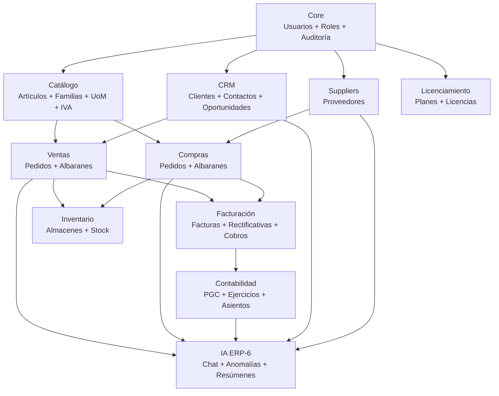

# Diagrama: Relación de módulos

## Leyenda

- Las flechas indican dependencia de datos (el módulo origen proporciona datos al destino)
- **Core** es fundamento de todos los módulos
- **Catalog** es necesario para crear líneas de pedidos y facturas
- **IA** consume datos de todos los módulos (solo lectura)
